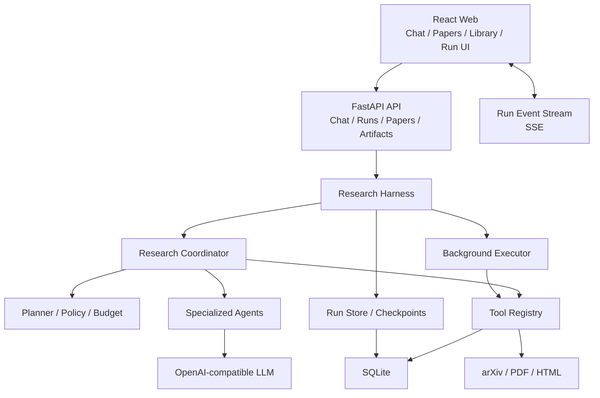
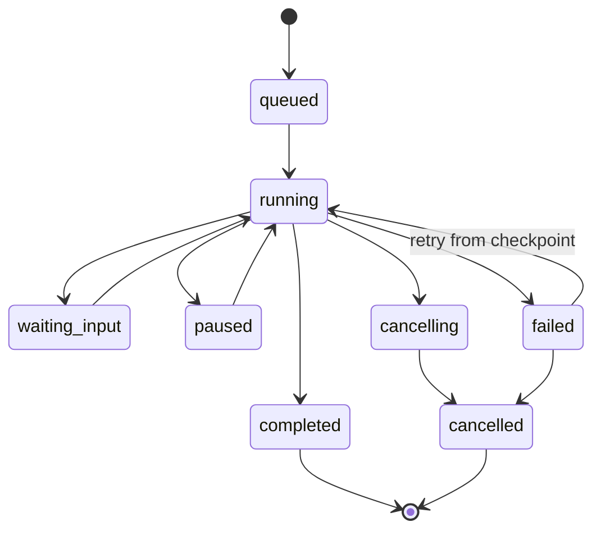

# PaperWiki Agentic Research 重构路线图

版本：v0.1

性质：产品与工程实施路线，不自动占用编号 iteration

## 1. 重构结论

本项目不应推倒重写。当前代码已具备四块可复用基础：

1. `assistant-ui` Chat 会话树、SSE 流式响应、编辑/重新生成/分支；
2. 论文抓取、上传、去重、Docling 解析和内容寻址存储；
3. FTS5/正文检索、`search_metadata`、`search_text`、`open_evidence` 与引用白名单；
4. 登录、用户隔离、私有上传和资料库。

真正需要重构的是中间的“任务执行层”：目前普通 Chat 和论文 QA Agent 是两条分离链路，没有持久化 Workflow、后台 Run、步骤事件、确认点和 Artifact。目标架构是在二者之间增加 Research Harness，并逐步让现有能力以工具形式接入。

## 2. 目标架构



### 2.1 分层职责

| 层 | 负责 | 不负责 |
| --- | --- | --- |
| API | 鉴权、校验、创建 Run、查询快照、SSE | 长时间执行 Workflow |
| Harness | 状态机、步骤调度、暂停恢复、确认、预算、重试 | 具体论文业务实现 |
| Coordinator | 理解目标、生成计划、选择 Agent/工具、收尾 | 绕过 Harness 直接写状态 |
| Tool Registry | 工具 schema、权限、调用、结果清洗和审计 | 自由决定研究目标 |
| Specialized Agents | 搜索、筛选、阅读、抽取、综合、校验 | 访问未授权论文或私有数据 |
| Repository/DB | 持久化 Run、Step、Event、Artifact、Evidence | 模型推理 |
| Background Executor | 在请求之外执行可恢复工作 | 保存不可审计的进程内真相 |

## 3. Harness 设计

### 3.1 Run 状态机



合法状态变更必须由 Harness 统一校验。前端不能通过任意 PATCH 把失败任务直接标为成功。

### 3.2 标准执行循环

1. 创建 Run，保存用户原始目标、模式、权限和预算。
2. Coordinator 将目标转换为结构化 `ResearchBrief`。
3. 若存在阻断歧义，创建 Decision 并进入 `waiting_input`。
4. Planner 生成版本化 Plan 和步骤依赖。
5. Executor 领取下一个可运行 Step。
6. Step 调用 Agent/Tool；过程写入 Event，重要输出写入 Artifact/Evidence。
7. 成功后原子保存结果和 checkpoint。
8. 失败时按策略重试；超过上限进入 failed 或创建 Decision。
9. 所有必需步骤完成后运行 Citation Validator。
10. 保存报告和资料库项目，Run 进入 completed。

### 3.3 事件模型

事件用于 SSE 和审计，建议类型：

```text
run.created
run.started
run.paused
run.waiting_input
run.resumed
run.completed
run.failed
step.queued
step.started
step.progress
step.completed
step.failed
tool.started
tool.completed
tool.failed
decision.requested
decision.resolved
artifact.created
evidence.registered
```

`step.progress` 必须限频和可合并，避免每个 token/日志行都写数据库。

### 3.4 Checkpoint

每个成功步骤至少保存：

- Plan 版本；
- 已完成 Step ID；
- 论文候选与入选集合；
- 已解析 `source_hash`；
- Paper Brief 版本；
- Evidence Registry；
- Artifact 版本；
- 预算消耗；
- 下一步可运行集合。

恢复时以数据库状态为真相，不依赖内存中的 Python 对象。

### 3.5 幂等与重试

- 每个 Step 使用稳定 `idempotency_key`；
- 工具调用保存 attempt；
- 导入以现有 `source + source_id` 去重；
- 解析以 `source_hash` 复用；
- 报告生成创建版本，不覆盖成功旧版本；
- 网络/LLM 瞬态错误指数退避；
- 4xx、权限错误和 schema 错误不盲目重试；
- 用户点击重试会创建新 attempt，而非擦除失败证据。

### 3.6 预算

Run Budget 至少包含：

- 最大候选论文数；
- 最大全文解析数；
- 最大模型调用数；
- 最大工具调用数；
- 最大 wall-clock；
- 可选预计费用上限。

预算内默认自动执行；预计越界时创建 Decision。

## 4. 数据模型建议

沿用现有 SQLite 和 migration runner，建议从 schema v5 起逐步加入。

### 4.1 `research_runs`

```text
id TEXT PRIMARY KEY
user_id INTEGER NOT NULL
thread_id TEXT
title TEXT NOT NULL
goal TEXT NOT NULL
mode TEXT NOT NULL
status TEXT NOT NULL
current_step_id TEXT
plan_version INTEGER NOT NULL
budget_json TEXT NOT NULL
usage_json TEXT NOT NULL
error_code TEXT
error_message TEXT
created_at / started_at / updated_at / completed_at
```

### 4.2 `research_steps`

```text
id TEXT PRIMARY KEY
run_id TEXT NOT NULL
step_key TEXT NOT NULL
step_type TEXT NOT NULL
title TEXT NOT NULL
agent_name TEXT
status TEXT NOT NULL
position INTEGER NOT NULL
depends_on_json TEXT NOT NULL
input_json / output_json
attempt_count INTEGER NOT NULL
started_at / completed_at
UNIQUE(run_id, step_key, plan_version)
```

### 4.3 `research_events`

```text
id INTEGER PRIMARY KEY AUTOINCREMENT
run_id TEXT NOT NULL
step_id TEXT
event_type TEXT NOT NULL
summary TEXT NOT NULL
payload_json TEXT NOT NULL
created_at
```

### 4.4 `research_decisions`

```text
id TEXT PRIMARY KEY
run_id TEXT NOT NULL
step_id TEXT
question TEXT NOT NULL
options_json TEXT NOT NULL
recommended_option TEXT
status TEXT NOT NULL
answer_json TEXT
created_at / resolved_at
```

### 4.5 `research_artifacts`

```text
id TEXT PRIMARY KEY
run_id TEXT NOT NULL
user_id INTEGER NOT NULL
artifact_type TEXT NOT NULL
title TEXT NOT NULL
version INTEGER NOT NULL
status TEXT NOT NULL
content_json / content_markdown
created_at / updated_at
```

Artifact 类型首版：`paper_collection`、`paper_brief`、`comparison_matrix`、`research_report`、`topic_graph`。

### 4.6 `research_evidence`

复用现有 chunk/evidence 结构，新增 Run 级登记：

```text
id TEXT PRIMARY KEY
run_id TEXT NOT NULL
paper_id INTEGER NOT NULL
chunk_id INTEGER
source_hash TEXT NOT NULL
char_start / char_end
quote_excerpt TEXT NOT NULL
opened_by_step_id TEXT NOT NULL
created_at
```

报告引用只能指向同一 Run 已登记且用户有权限访问的 Evidence。

## 5. API 方向

### 5.1 Run API

| Method | Path | 用途 |
| --- | --- | --- |
| POST | `/api/research/runs` | 创建 Run，立即返回快照 |
| GET | `/api/research/runs` | 当前用户任务列表，按状态筛选 |
| GET | `/api/research/runs/{id}` | Run、步骤、决策和 Artifact 快照 |
| GET | `/api/research/runs/{id}/events` | SSE 增量事件 |
| POST | `/api/research/runs/{id}/pause` | 请求安全暂停 |
| POST | `/api/research/runs/{id}/resume` | 从 checkpoint 继续 |
| POST | `/api/research/runs/{id}/cancel` | 取消未完成步骤 |
| POST | `/api/research/runs/{id}/retry` | 重试失败步骤 |
| POST | `/api/research/decisions/{id}/resolve` | 回答关键问题 |

创建 Run 请求建议：

```json
{
  "thread_id": "thread_xxx",
  "goal": "帮我调研 2023 年以来 RAG 检索优化论文",
  "mode": "deep_research",
  "attachments": [],
  "budget": {
    "max_candidates": 50,
    "max_fulltext_papers": 12
  }
}
```

### 5.2 Artifact API

| Method | Path | 用途 |
| --- | --- | --- |
| GET | `/api/research/artifacts/{id}` | 读取报告/集合/矩阵/图谱 |
| GET | `/api/research/artifacts/{id}/versions` | 版本列表 |
| POST | `/api/research/artifacts/{id}/continue` | 基于产物创建关联 Run |
| GET | `/api/research/evidence/{id}` | 读取证据和跳转信息 |

## 6. 前端重构方向

### 6.1 路由

在现有 `src/App.tsx` 基础上增加：

```text
/runs/:runId
/reports/:reportId
/collections/:collectionId
/graphs/:graphId
```

`/`、`/papers`、`/library`继续作为三个并列主入口。

### 6.2 建议模块

```text
src/features/research/
  run-page.tsx
  run-drawer.tsx
  task-center.tsx
  workflow-panel.tsx
  workflow-step.tsx
  decision-card.tsx
  artifact-list.tsx
  evidence-inspector.tsx
  hooks.ts

src/features/reports/
  page.tsx
  outline.tsx
  citation-inspector.tsx

src/components/chat/
  research-composer-controls.tsx
  research-run-message.tsx
```

不要把全部 Workflow UI 塞进现有 `chat-thread.tsx`。Chat 消息组件只负责引用 Run，运行详情由 research feature 自己维护。

### 6.3 客户端状态

- React Query 保存服务器快照；
- SSE Event 根据 `event_id`增量合并；
- 断线后使用 `Last-Event-ID` 或重新拉取快照；
- Run 状态不得只存在组件 local state；
- 切换用户时继续沿用当前策略清除所有私有缓存；
- 任务中心使用一个全局轻量查询，不重复订阅每个已完成 Run。

## 7. 后台执行策略

### 7.1 课程版建议

首版可以使用单进程受控后台 Executor，但接口和状态必须按未来队列设计：

- FastAPI lifespan 启动 executor；
- 数据库持久化待执行 Step；
- executor 通过租约领取任务；
- 每个 Step 定期刷新 lease；
- 进程重启后过期 lease 回到可恢复状态；
- 限制 Docling 和 LLM 并发，避免拖垮请求服务。

不要只用无追踪的 `asyncio.create_task`。它无法保证重启恢复，也难以解释任务为何丢失。

### 7.2 后续生产化

规模扩大后替换为 Redis + RQ/Celery/Arq 等队列；Harness 和数据模型不应依赖具体队列实现。

## 8. 迭代路线

以下编号是建议，不代表已经执行 iter-start。

### Iter11：Research Run 与 Harness 骨架

目标：建立持久化任务真相，不接完整调研。

- schema v5：runs、steps、events、decisions；
- Run 状态机和合法转换；
- 创建/查询/暂停/继续/取消 API；
- SSE 事件；
- 最小后台 executor 和重启恢复；
- 使用确定性测试工具跑通 3 步示例 Workflow；
- 前端任务中心最小状态列表。

验收：刷新页面和重启后任务状态可解释；非法状态转换失败；100 并发读取不受后台任务阻塞。

### Iter12：Chat 接入 Agent Run 与 Workflow UI

目标：把首页从普通 Chat 升级为 Agent 指挥中心。

- 意图路由：普通对话 / 深度调研；
- Chat Run 消息卡；
- 桌面 Workflow 面板、移动 Drawer；
- 步骤展开、状态、暂停/停止；
- waiting_input 问题卡和恢复；
- 任务中心角标与 Peek；
- Playwright 覆盖桌面和 390px。

验收：用户输入研究请求后 1 秒内看到 Run；离开 Chat 后任务继续；关键问题回答后原地恢复。

### Iter13：主题调研完整数据链路

目标：跑通搜索 → 筛选 → 导入 → 解析 → Paper Brief。

- Coordinator、Search Agent、Screening Agent、Reader/Extraction Agent；
- 现有论文检索、抓取和 Docling 工具化；
- 候选、入选、排除理由和 Paper Brief Artifact；
- 幂等导入、source hash 复用、失败重试；
- 真实 arXiv smoke。

验收：从一句话获得至少 8 篇入选论文和结构化阅读卡；重复运行不重复导入/解析。

### Iter14：报告、对比矩阵与证据闭环

目标：完成旗舰 Workflow 的可信交付。

- **状态：已完成（2026-07-16）**。实现 Synthesis、Comparison、Citation Verifier、Report Agent；Librarian/资料库项目化顺延 Iter15。
- 实现 comparison matrix、versioned research report、durable Evidence/Citation Registry 与严格 source-hash/ACL 校验。
- 实现报告目录、Citation inspector、四状态、历史 stale 版本和显式重新生成。
- 自动保存私有资料库仍属 Iter15，不在 Iter14 伪装完成。

验收：结构与安全链路、三视口 UI 和依赖注入 17 步 workflow 已通过；引用全部可定位，无效引用阻止“已验证”。真实至少 5 篇论文的付费端到端 smoke 仍需单独授权。

### Iter15：研究脉络、图谱与资料库项目化

目标：完成进阶展示和长期沉淀。

- **状态：已完成（2026-07-17）**。schema v9、owner-only 项目、七步 project Run、版本化主题簇/时间线/关系图、dependency DAG、反向链接和三视口 UI 已交付。
- 时间线/主题簇 Artifact；
- 恢复概念图谱前端；
- 资料库支持项目、报告、集合、图谱类型；
- Run、论文、报告和图谱之间的反向链接；
- 移动端图谱退化为列表。

验收：调研报告可打开脉络图，节点可回到论文证据。

### Iter16：Evaluation、性能与答辩打磨

目标：把课程指标变成可展示证据。

- **状态：本轮授权范围已完成（2026-07-17）**。生产 schema/API/UI 保持 v9；未执行未经授权的付费 judge。
- 固定 5 篇公开 arXiv 论文、60 adjudicated 案例的 Citation entailment/coverage gold set；三标签均衡，覆盖报告、矩阵、主题簇、时间线和语义图谱边。
- strict prediction scorer 与可选单请求 LLM judge，分开报告 macro-F1、supported precision、false-accept、语义 coverage、确定性关系和 Artifact 分项；真实 judge 未运行时明确“未验证”。
- 隔离 v9/120 论文、认证 Cookie、100 requests/100 workers 非 LLM smoke 已通过，p95/max <3s，Run 创建 <500ms。
- lease 过期/重启恢复/旧 worker fencing 与 SSE 续传回归通过；连续 Playwright 路径覆盖 Chat → Run → 固定报告 → Citation Evidence → 论文定位 → 项目 → Graph Evidence。
- 1440/1024/390、键盘焦点、reduced-motion、44px 与无横向溢出继续通过；未为本轮制造新的生产演示 seed 或 UI 体系。

验收：代码、测试、性能记录和 validation-only 报告已落库；课程 `>90%` 质量指标必须等真实 judge 获得单独授权并达到阈值后才能勾选。

## 9. 测试策略

### 9.1 后端

- 状态机单元测试；
- repository 事务与迁移测试；
- executor 领取、lease、恢复和幂等测试；
- tool schema、权限、超时和重试测试；
- 引用白名单与私有论文隔离测试；
- SSE 顺序、断线续传和限频测试。

### 9.2 前端

- TypeScript 契约；
- Run 快照与 Event reducer 测试；
- Workflow 各状态组件测试；
- Playwright：创建 Run、等待确认、暂停、继续、完成、打开引用；
- 桌面、平板、390px 移动宽度；
- 键盘与焦点恢复。

### 9.3 真实模型

真实 smoke 必须显式验证：

- 使用真实模型而非 fallback；
- 至少执行 6 个 Workflow 步骤；
- 至少调用搜索、解析/阅读、证据和报告工具；
- 最终报告引用多篇论文；
- 所有引用属于本 Run 已打开 Evidence；
- API Key 和 provider 原始响应不进入日志。

## 10. 答辩演示脚本

推荐控制在 6–8 分钟：

1. 用 20 秒说明痛点：传统流程需要多页面手动串联。
2. 在 Chat 输入标准主题调研指令。
3. Workflow 立即出现，展示计划与实时步骤。
4. 展开“搜索”和“筛选”，展示候选数量与排除理由。
5. 展开“解析/阅读”，展示多 Agent 交接和证据登记。
6. 如需展示确认，在预置任务中触发一个关键范围问题并选择推荐项。
7. 打开完成报告，点击引用跳到论文证据。
8. 打开对比矩阵和研究脉络图。
9. 进入资料库，证明报告和论文集合已经沉淀。
10. 最后展示准确率与 100 并发报告。

为避免现场等待，准备两类 Run：

- 一个现场新建并实时执行前几步；
- 一个已完成的同主题 Run，用于展示报告、图谱和引用跳转。

这不是伪造结果：已完成 Run 必须由真实模型和真实论文预先生成，并保留完整事件和验证记录。

## 11. 主要风险与控制

| 风险 | 后果 | 控制 |
| --- | --- | --- |
| Workflow 只是前端假进度 | 创新点不成立 | 每个节点绑定真实 Step/Event/Artifact |
| 长任务阻塞 API | 不满足性能要求 | 创建 Run 立即返回，后台执行 |
| 多 Agent 只有名字 | 进阶要求说服力弱 | typed handoff、角色 schema、步骤审计 |
| 报告有幻觉引用 | 可信度失败 | Evidence Registry + Citation Validator |
| 自动执行过度打扰 | 用户频繁确认 | 明确 must-confirm 列表，其余自动 |
| 自动执行成本失控 | API 费用不稳定 | Run Budget、阈值确认、调用统计 |
| 进程重启丢任务 | 演示不稳定 | checkpoint、lease、恢复测试 |
| UI 为炫而炫 | 信息密度差 | 动效只服务状态，默认摘要、按需展开 |
| SQLite 写锁 | 并发失败 | 短事务、单写入队列评估、并发 smoke |
| 课程 >90% 无法证明 | 非功能验收失败 | 固定 gold set 和明确分项指标 |

## 12. 开始实现前的决策门

进入 Iter11 前应确认：

1. `Research Run`、`Step`、`Event`、`Decision`、`Artifact` schema；
2. 首版后台 executor 采用单进程租约模型还是直接引入外部队列；
3. 标准主题调研的默认论文数量和预算；
4. 报告首版导出范围是否仅 Markdown；
5. gold set 的主题与人工标注方法；
6. 标准答辩演示主题。

建议默认决策：先使用 SQLite + 单进程可恢复 executor、默认 50 篇候选/12 篇全文、首版只导出 Markdown，以最小技术扩张完成可验证闭环。
