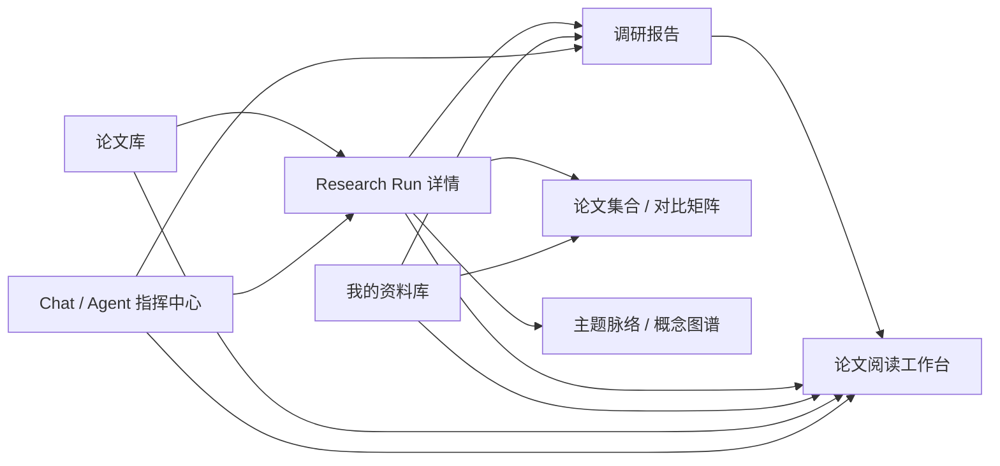

# PaperWiki Workflow UX/UI 规格

版本：v0.1

设计目标：ChatGPT 式自然语言入口 + Claude Code Agent View 式执行可见性 + 科研工具所需的证据密度

## 1. 体验目标

用户第一次进入产品时，应在 10 秒内理解三件事：

1. 可以直接输入研究目标；
2. 系统会真的执行论文检索和阅读任务；
3. 执行过程、证据和结果都能查看，而不是只得到一段不可核验的回答。

“炫酷”来自实时性、层次和控制感：动态步骤、活动脉冲、工具摘要、证据流、任务状态切换、平滑展开和完成反馈。避免大面积霓虹渐变、装饰性光斑和堆卡片，以免降低论文工具的可信感。

## 2. 全局信息架构



### 2.1 全局侧栏

侧栏固定保留三个主入口，不将 Workflow 独立成第四个业务频道。

| 元素 | 文案 | 行为 |
| --- | --- | --- |
| 品牌区 | PaperWiki / Agentic Research | 点击回到 Chat 首页 |
| 主按钮 | `+ 新建研究` | 创建空 Chat 线程并聚焦输入框 |
| 导航 | Chat | 跳转 `/` |
| 导航 | 论文库 | 跳转 `/papers` |
| 导航 | 我的资料库 | 跳转 `/library` |
| 最近任务 | 最近 5 个 Run | 点击跳转 `/runs/:runId` |
| 用户区 | 用户名、设置、退出 | 设置打开 Popover；退出清理用户缓存 |

桌面端侧栏宽 248–272px，可收起为 64px 图标栏。移动端使用左侧 Sheet，选中导航后自动关闭。

### 2.2 全局顶部栏

| 元素 | 行为 |
| --- | --- |
| 当前页面标题/面包屑 | 显示当前位置；二级页面可回到所属主入口 |
| 全局搜索/命令按钮 | 打开 Command Palette，可搜索论文、报告、任务并执行“新建调研” |
| `任务中心` | 打开右侧 Drawer；角标优先显示等待确认数，其次显示运行中数 |
| 主题切换 | 浅色/深色/跟随系统 |
| 用户菜单 | 账户、模型状态、退出 |

任务中心按 `需要确认`、`正在执行`、`已完成`、`失败`分组。每行只显示任务名、当前摘要、状态和时间；点击进入 Run 详情。

## 3. Chat / Agent 指挥中心

路由：`/`

### 3.1 空会话

```text
┌──────────────┬──────────────────────────────────────────────────────┐
│ 最近对话      │                 今天想研究什么？                      │
│              │  描述主题、时间范围、重点和期望产物，Agent 会执行。    │
│ + 新建对话    │                                                      │
│              │  ┌────────────────────────────────────────────────┐  │
│ 今天          │  │ 帮我调研……                                    │  │
│ · RAG 调研    │  │                                                │  │
│ · 论文对比    │  │ [+]  自动模式 ▾              [↑ 开始]          │  │
│              │  └────────────────────────────────────────────────┘  │
│              │  [主题调研] [对比论文] [精读论文] [解释概念]          │
└──────────────┴──────────────────────────────────────────────────────┘
```

#### 输入区控件

| 控件 | 默认 | 行为 |
| --- | --- | --- |
| `+` | 可用 | 上传 PDF、粘贴 arXiv URL、选择资料库论文 |
| 模式 | `自动模式` | 系统判断普通回答或 Agent Workflow；可切换“普通对话”“深度调研” |
| 执行策略 | `默认自动` | 展示说明：普通动作自动，关键问题再确认；首版不提供危险的“跳过所有确认” |
| 发送 | 可用 | 普通问题进入流式回答；研究意图立即创建 Run |
| 停止 | 生成/运行中 | 普通回答停止生成；Run 弹出“暂停/终止”选择 |

#### 快捷提示卡

- `调研一个主题`：填入“帮我调研 ___，重点关注 ___”。
- `对比几篇论文`：打开论文选择器。
- `精读一篇论文`：提示上传 PDF 或粘贴 URL。
- `解释一个概念`：走普通 Chat；需要引用时可升级为调研。

卡片只在空会话出现；点击后填入输入框，不直接执行，避免误触付费调用。

### 3.2 Run 进行中的会话

桌面宽度 ≥ 1200px 使用三栏：会话列表 240px、对话主区、自适应 Workflow 面板 380–460px。较窄桌面将 Workflow 变为右侧 Drawer。

```text
┌───────────┬───────────────────────────────┬──────────────────────────┐
│ 会话列表   │ 对话                          │ Workflow                 │
│           │ 用户：帮我调研……               │ ● 正在执行  5/9          │
│           │ Agent：已制定计划，开始搜索。    │                          │
│           │                               │ ✓ 理解任务               │
│           │ [调研任务卡：点击查看]           │ ✓ 制定计划               │
│           │                               │ ✓ 搜索 42 篇             │
│           │                               │ ✓ 筛选 12 篇             │
│           │                               │ ◉ 解析正文 7/12          │
│           │                               │ ○ 抽取与对比             │
│           │                               │ ○ 撰写报告               │
│           │                               │ ○ 引用校验               │
│           │                               │ ○ 保存产物               │
│           │ [输入后续要求……]               │ [暂停] [停止] [展开详情]  │
└───────────┴───────────────────────────────┴──────────────────────────┘
```

对话中只插入关键里程碑，不刷屏输出每次工具调用：

- 计划已生成；
- 找到并筛选论文；
- 需要用户确认；
- 某一步失败且自动重试；
- 报告与产物完成。

完整过程放在 Workflow 面板和 Run 详情页。

## 4. Workflow 面板

### 4.1 Run Header

显示：

- Run 标题；
- 总状态及状态图标；
- 完成步骤数/总步骤数；
- 已发现、入选、已解析论文数；
- 运行时长；
- 模型调用与工具调用计数；
- `暂停`、`继续`、`停止`、`更多`。

`更多`菜单：复制任务、查看完整 Run、导出事件、报告问题。删除 Run 属于破坏性操作，需二次确认。

### 4.2 步骤节点

标准主题调研节点：

1. 理解研究目标；
2. 制定调研计划；
3. 搜索候选论文；
4. 筛选与去重；
5. 抓取与解析全文；
6. 阅读与结构化抽取；
7. 跨论文比较与研究脉络；
8. 撰写调研报告；
9. 引用与质量校验；
10. 保存到资料库。

计划可以由 Agent 根据任务增删步骤，但 UI 必须使用稳定的类型和自然语言名称，不直接显示内部函数名。

### 4.3 节点状态

| 状态 | 图标/颜色 | 动效 | 用户操作 |
| --- | --- | --- | --- |
| queued | 空心圆 / muted | 无 | 可查看预计动作 |
| running | 实心脉冲 / primary | 低频呼吸与细进度线 | 展开、暂停整个 Run |
| waiting_input | 问号 / warning | 一次提示闪烁，之后静止 | 回答问题 |
| completed | 对勾 / success | 完成瞬间轻微描边扩散 | 查看产物、重跑此后步骤 |
| failed | 感叹号 / danger | 无循环动画 | 查看错误、重试、跳过 |
| skipped | 横线 / muted | 无 | 查看跳过原因 |
| paused | 暂停 / warning-muted | 无 | 继续 |
| cancelled | 停止 / neutral | 无 | 复制任务重新开始 |

颜色不能是唯一状态信息，必须同时有图标和文字。

### 4.4 节点展开内容

默认摘要行示例：

> 正在使用 Docling 解析第 7/12 篇论文 · 2 篇复用已有正文

展开后包含四个 Tab：

| Tab | 内容 |
| --- | --- |
| 概览 | Agent 名称、目的、输入摘要、输出摘要、耗时 |
| 工具 | 工具名、已清洗参数、结果数量、重试次数 |
| 证据/产物 | 论文卡、Evidence、矩阵或文件链接 |
| 事件 | 时间线日志；默认折叠低价值心跳和 token 增量 |

不得展示隐藏 chain-of-thought。可展示“选择这 12 篇的可审计理由”，因为它属于结构化决策结果。

### 4.5 关键问题卡

当 Run 等待输入时，Workflow 面板自动滚动到问题卡：

```text
需要你确认
“Agent Memory”可以指模型上下文记忆，也可以指长期用户记忆。
本次调研重点是哪一种？

[长期用户记忆（推荐）]
[模型上下文与压缩]
[两者都覆盖]
[输入自己的范围……]
```

按钮规则：

- 推荐项为 Primary；
- 其他项为 Outline；
- 每项下方用一句话说明对论文集合和耗时的影响；
- 点击后立即记录 Decision 并恢复原步骤；
- 提供 `终止任务` 文本按钮，但不与推荐项争夺视觉焦点。

## 5. Research Run 详情页

路由：`/runs/:runId`

用于从任务中心进入，或需要比 Chat 侧栏更完整地检查任务。

### 5.1 页面布局

- 顶部：面包屑、Run 标题、状态、进度和控制按钮。
- 左侧主区：纵向 Workflow 时间线。
- 右侧检查器：选中步骤、论文、工具调用、证据或错误的详细信息。
- 底部/末尾：Artifact 交付区。

### 5.2 顶部按钮

| 按钮 | 条件 | 行为 |
| --- | --- | --- |
| 暂停 | running | 当前安全点暂停，不中断正在写数据库的原子操作 |
| 继续 | paused/waiting_input 已解决 | 从 checkpoint 恢复 |
| 停止 | running/paused | 确认后取消未开始步骤，保留已完成产物 |
| 重试失败步骤 | failed | 从最近 checkpoint 重试并生成新 attempt |
| 复制任务 | 任意 | 复制目标和参数，创建新 Run |
| 打开报告 | report ready | 跳转 `/reports/:reportId` |

## 6. 论文库

路由：`/papers`

保留现有独立入口，但与 Agent Run 打通。

### 6.1 页面区域

1. 顶部标题与动作；
2. 搜索/筛选工具栏；
3. 当前结果计数和批量操作；
4. 桌面表格 / 移动卡片；
5. 导入、上传与后台任务状态。

### 6.2 顶部按钮与跳转

| 按钮 | 行为 |
| --- | --- |
| `让 Agent 调研` | 使用当前搜索词和筛选条件预填 Chat 深度调研 |
| `同步来源论文` | 打开来源、关键词、时间和数量对话框；确认后创建短 Run |
| `上传 PDF` | 选择私有/公开后上传；默认私有 |
| 论文标题/查看 | 跳转 `/papers/:paperId` |
| `加入对比` | 加入临时对比篮；2–6 篇时可创建对比 Run |
| `收藏` | 保存到资料库待整理目录 |
| `来源任务`徽标 | 若由 Agent 导入，跳转对应 `/runs/:runId` |

导入和解析不再用长时间阻塞按钮。点击后立即创建后台任务并在任务中心显示。

## 7. 单篇论文阅读工作台

路由：`/papers/:paperId`

保留现有 `阅读 / 并排 / Chat` 布局切换，优化为研究上下文工作台。

### 7.1 顶部动作

| 按钮 | 行为 |
| --- | --- |
| 返回论文库 | 返回 `/papers`，保留筛选参数 |
| 收藏 | 加入资料库 |
| 解析全文/重新解析 | 创建后台解析步骤，状态进入任务中心 |
| 生成概要 | 创建单篇阅读 Run 或局部步骤 |
| 加入调研 | 打开 Run 选择器或创建新调研 |
| 加入对比 | 加入对比篮 |
| 下载 PDF | 下载 |
| 来源页面 | 新窗口打开原始来源 |

### 7.2 内容区

- `原文`：PDF / 解析文本切换；
- `概要`：summary、concepts、methods、experiments 子导航；
- `证据`：被调研报告引用的片段与反向链接；
- `笔记`：用户笔记；
- `Chat`：当前论文上下文对话。

从报告点击引用进入时，页面自动切换到“证据”，高亮对应片段，并提供 `返回报告`。

## 8. 我的资料库

路由：`/library`

### 8.1 对象类型

资料库不再只展示收藏论文，增加类型筛选：

- 全部；
- 论文；
- 调研项目；
- 报告；
- 图谱。

### 8.2 调研项目卡

显示：主题、Run 状态、论文数量、报告状态、最后更新时间和标签。

按钮：

- `打开项目`：进入项目聚合页；
- `查看报告`：进入报告；
- `继续调研`：以当前产物为上下文创建新 Run；
- `整理到文件夹`：移动；
- `更多`：重命名、导出、删除。删除需要确认。

## 9. 调研报告

路由：`/reports/:reportId`

### 9.1 页面结构

- 左侧：报告目录；
- 中间：正文；
- 右侧：引用与证据检查器；
- 顶部：报告状态、来源 Run、验证状态和操作。

报告推荐章节：

1. 调研范围与方法；
2. 代表性论文；
3. 方法分类；
4. 对比矩阵；
5. 数据集与评测；
6. 主要结论与共识；
7. 分歧、局限与研究空白；
8. 发展脉络；
9. 参考论文。

### 9.2 顶部按钮

| 按钮 | 行为 |
| --- | --- |
| 返回任务 | 跳转来源 `/runs/:runId` |
| 基于报告继续研究 | 将报告摘要、论文集合和未解决问题带入新 Run |
| 重新生成局部章节 | 选择章节并从对应 checkpoint 派生新 attempt |
| 复制 Markdown | 复制保留引用标识的 Markdown |
| 导出 | 首版支持 Markdown；PDF/DOCX 可后置 |
| 保存版本 | 创建报告版本，不覆盖旧版本 |

引用点击后，右侧显示论文、章节、原文片段和 `在阅读器中打开`。

## 10. 主题脉络与概念图谱

路由：`/graphs/:graphId`

图谱是调研 Artifact，不作为首屏装饰。

- 时间轴模式：年份 → 代表论文 → 方法演进；
- 主题簇模式：概念/方法节点与论文关系；
- 点击论文节点打开右侧详情；
- `在阅读器中打开`跳转论文；
- `仅查看入选论文`、`显示排除候选`、`按年份着色`为工具栏控制；
- 移动端退化为时间线列表，不强行缩放复杂画布。

## 11. 响应式规则

| 宽度 | 布局 |
| --- | --- |
| ≥ 1440px | 侧栏 + Chat 主区 + 固定 Workflow 面板 |
| 1200–1439px | 侧栏 + 主区 + 较窄 Workflow 面板 |
| 768–1199px | 侧栏可收起；Workflow 使用右侧 Drawer |
| 320–767px | 单栏；侧栏 Sheet；Workflow 使用全屏 Bottom Sheet/页面 |

移动端关键规则：

- 输入框始终可见，但不遮挡最后一条消息；
- Run 状态以粘性迷你条显示，点击进入全屏 Workflow；
- 步骤展开一次只显示一个；
- 表格转为卡片或横向滚动的明确数据区域；
- 点击目标最小 44×44px；
- 长论文标题、作者和 URL 必须换行或截断，不撑破布局。

## 12. 视觉系统

### 12.1 风格关键词

`精密`、`可信`、`实时`、`研究感`、`克制的未来感`。

保留现有 Noto Sans SC、shadcn/ui、Tailwind 和暖色设计基础。Workflow 引入局部“执行层”语言：

- 普通内容继续使用无衬线字体；
- 工具名、事件时间、ID 和计数使用等宽字体；
- 大面积背景保持安静，动态强调只用于正在运行节点；
- 状态使用 semantic token，不在组件中散落色值。

### 12.2 建议新增 token

```text
--surface-raised
--surface-sunken
--workflow-line
--status-running
--status-waiting
--status-success
--status-failed
--status-paused
--evidence-highlight
--focus-ring
```

### 12.3 动效

- running 节点：1.8–2.4 秒低频脉冲；
- 新事件：150–220ms 淡入和轻微上移；
- 步骤展开：200ms 高度与透明度过渡；
- 完成：一次性对勾描边，不循环庆祝动画；
- 遵循 `prefers-reduced-motion`，关闭位移动画和循环脉冲。

## 13. 通用状态与文案

### 13.1 Loading

- 短请求使用骨架或局部 spinner；
- 长任务必须显示具体步骤，不使用无限旋转器代替状态；
- 页面刷新时复用已知 Run 快照，避免整页空白。

### 13.2 Empty

空状态必须告诉用户下一步：

- 无论文：`让 Agent 调研一个主题`；
- 无资料库产物：`开始第一次调研`；
- 无报告：`完成调研后会在这里生成报告`。

### 13.3 Error

错误包含：失败对象、原因摘要、是否已重试、可执行动作。

示例：

> 论文 7/12 的 PDF 解析失败：文件损坏。已自动重试 2 次。你可以跳过该论文、改用 HTML，或重新上传 PDF。

按钮：`改用 HTML`、`重新上传`、`跳过此论文`、`停止任务`。

## 14. 可访问性

- Workflow 节点使用真实按钮，展开状态提供 `aria-expanded`。
- 动态事件使用礼貌级 `aria-live`，不朗读每个 token。
- 颜色之外提供图标和文字状态。
- 所有图标按钮提供可见 Tooltip 和 `aria-label`。
- 焦点顺序：全局导航 → 页面动作 → 主内容 → Workflow。
- Workflow Drawer 关闭后焦点返回触发按钮。
- 报告正文控制在舒适行宽，证据片段保留可选择文本。

## 15. 实现验收清单

- 三个主入口在桌面和移动端都可见且语义一致。
- 空 Chat 能在一个视口内表达核心价值并启动调研。
- 创建 Run 后 1 秒内出现 Workflow 外壳和第一条状态。
- 用户不展开步骤也能理解当前进度；展开后能看到足够的审计信息。
- waiting_input 在 Chat、任务中心和 Run 页三处状态一致。
- 用户离开 Chat 后任务继续运行，回来后状态恢复。
- 引用能从报告跳转到证据，再返回报告。
- 390px 下无横向溢出、按钮不重叠、输入框不遮挡内容。
- 键盘可完成新建调研、展开步骤、回答确认、打开报告。
- 页面无未处理 console error；深色与浅色主题状态色均可辨认。

## 16. Iter15 项目视图与界面降噪

- “我的资料库”使用“论文 / 研究项目 / 报告”二级视图；项目详情使用资料范围、主题簇、时间线、关系图、版本记录五个内容切换，不添加顶级入口。
- topic 后端仍保留真实 17 步，默认 UI 聚合为 7 个用户阶段；技术审计内可展开原始 step、attempt、Agent/tool/Artifact 标识。standalone Harness 始终显示真实三步。
- Workflow 窄面板只显示状态、Coverage、执行摘要和关键结论；完整报告改为固定版本路由，每次只展示“报告 / 对比 / 主张 / 引用”之一。用户文案显示“引用 1、原文证据、论文阅读卡”，`C1` 等仅存在默认折叠技术详情。
- 图谱桌面使用 SVG 关系线和 HTML button 节点；1024px 允许详情降级；390px 不渲染宽画布，使用节点/关系列表和等价详情操作。语义边支持键盘打开 Evidence Inspector，关闭后焦点返回原边。
- 设计限制为一层主容器，优先标题、留白和分隔线，减少嵌套卡片、Badge、渐变、光晕和持续动画。模式选择器使用 44px `rounded-xl` Radix Select，reduced-motion 下停用不必要动效。
